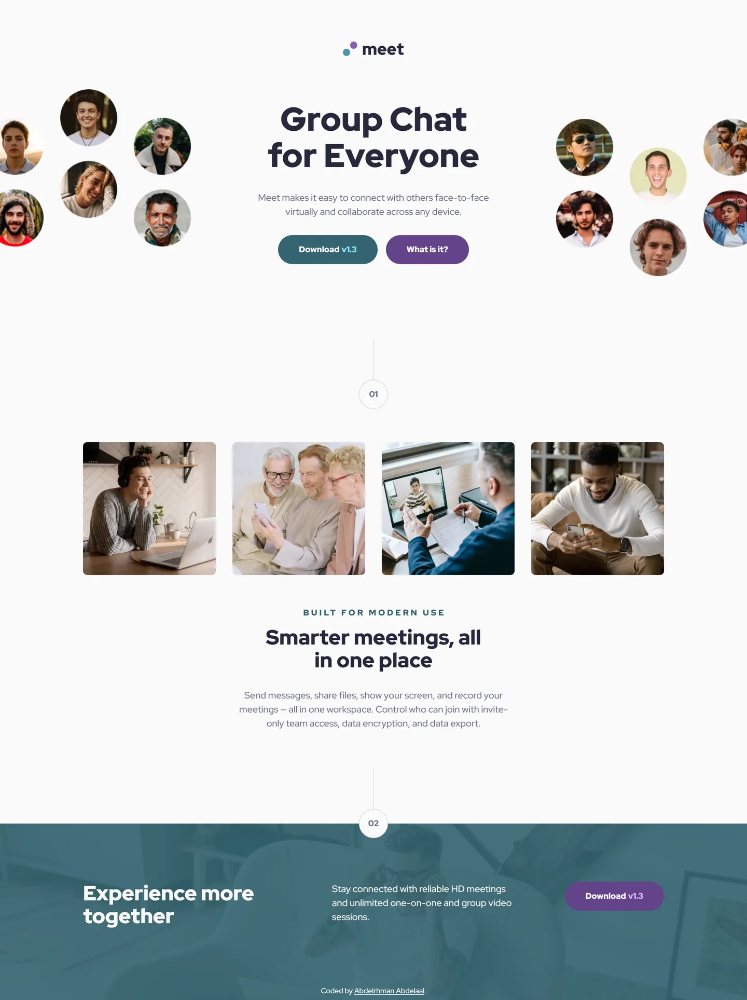

# Frontend Mentor - Meet landing page solution

This is a solution to the [Meet landing page challenge on Frontend Mentor](https://www.frontendmentor.io/challenges/meet-landing-page-rbTDS6OUR). Frontend Mentor challenges help you improve your coding skills by building realistic projects.

## Table of contents

- [Overview](#overview)
  - [Screenshot](#screenshot)
  - [Links](#links)
- [My process](#my-process)
  - [Built with](#built-with)
  - [Design deviations](#design-deviations)
- [Author](#author)

## Overview

### Screenshot

### Links

- Solution URL: [GitHub](https://github.com/MrBlackvanta/meet-landing-page)
- Live Site URL: [Netlify](https://vanta-meet-landing-page.netlify.app)

## My process

### Built with

- [Next.js 16](https://nextjs.org/) (App Router, React Compiler, Turbopack)
- [React 19](https://react.dev/)
- [TypeScript](https://www.typescriptlang.org/)
- [Tailwind CSS v4](https://tailwindcss.com/)
- Semantic HTML5 markup
- Mobile-first workflow

### Design deviations

Every colour in the design system was measured against its real backdrop — including
the photo behind the footer band, composited on rounded 8-bit channels. Four pairings
failed WCAG AA, so two colours moved by the smallest amount that clears the threshold,
keeping hue and saturation:

| Role                          | Design    | Shipped   | Contrast before → after |
| ----------------------------- | --------- | --------- | ----------------------- |
| Body copy, step numbers       | `#87879D` | `#71718B` | 3.36 → **4.53**         |
| Cyan (overline, button, band) | `#4D96A9` | `#346471` | 3.22 → **6.27**         |

Darkening the cyan also fixes the two-tone button label (`v1.3` on cyan went 2.32 →
4.53, on purple 2.87 → 4.52 after purple moved with it to `#64438A`) and the band's
body copy over the photo (2.81 → **4.99**), so the design's two-tone label and the
photo showing through the tint are both preserved rather than flattened.

Known gaps, both invisible to automated tooling:

- **Button hover states.** The design lightens buttons on hover (`#71C0D4`, `#B18BDD`),
  which drops the off-white label to 1.97:1 and 2.65:1. The design's hover colours are
  shipped as drawn; axe only ever tests the resting state.
- **The step badge ring and connector line** (`#D1D1DF` on `#FAFAFA`, 1.45:1) are
  decorative — neither identifies a control, so 1.4.11 does not apply.

Other departures from the file:

- **The footer band's tint is not in the exported assets.** The `.fig` embeds a
  pre-tinted bitmap while the shipped JPEG is untinted; solving the composite by least
  squares against both recovered the brand cyan at 90% opacity, which is what the CSS
  applies.
- **The desktop CTA row uses the design's own 12-column grid** (5 / 4 / 3 with 32px
  gutters) rather than hard-coded widths, giving 448 / 352 / 256 against the file's
  445 / 355 / 256.
- **Breakpoints between the three supplied frames are my own.** The gallery switches to
  four columns at 640px and carries the design's aspect ratios so cells scale instead of
  letterboxing; the hero adopts its two-image desktop layout at 1280px, below which the
  centred text column would collide with the faces.
- **The Frontend Mentor attribution is not in the design.** It sits inside the footer
  band, which grows the band by 28px (48px on mobile, where it wraps to two lines).

## Author

- Frontend Mentor - [@MrBlackvanta](https://www.frontendmentor.io/profile/MrBlackvanta)
- LinkedIn - [Abdelrhman Abdelaal](https://www.linkedin.com/in/abdelrhman-vanta/)
